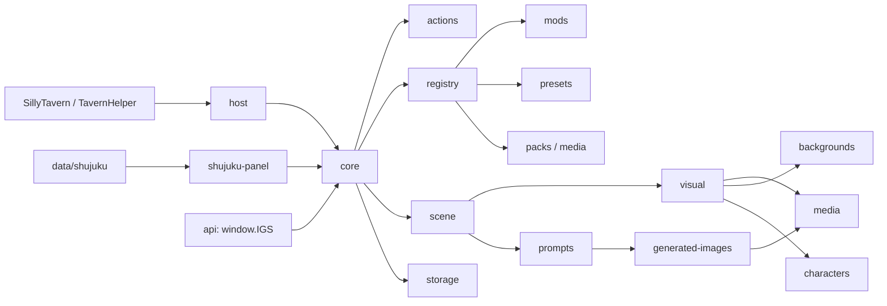

# 架构总览

本文件给 AI 和维护者提供第一视角的模块地图。具体行为仍以各目录 `CONTRACT.md` 为准。

## 总体数据流

## 层级边界

| 层 | 目录 | 允许职责 | 不允许职责 |
| --- | --- | --- | --- |
| 宿主适配 | `app/src/host/` | TavernHelper、DOM、输入框、魔法棒入口 | 场景解析、资源匹配、生图请求 |
| 生命周期 | `app/src/core/` | 启动、事件、全局状态、模块装配 | 具体 provider、具体 UI 皮肤 |
| 行为入口 | `app/src/actions/` | 统一动作注册、权限、快捷键调用 | 直接操作远程 API 或持久化细节 |
| 场景理解 | `app/src/scene/` | 正文解析、说话人、情绪、背景意图 | 直接渲染 DOM 或存图片 |
| 视觉渲染 | `app/src/visual/` | 图层、布局、视觉模式、舞台渲染 | 解析原始正文或写 shujuku |
| 资源管理 | `app/src/media/` | 图片池、Blob URL、缓存生命周期 | provider 请求参数拼装 |
| 生图系统 | `app/src/generated-images/` | provider、队列、轮询、请求结果 | UI token、正文解析 |
| 提示词 | `app/src/prompts/` | prompt context、adapter、模型 schema | 图片缓存、DOM 渲染 |
| 数据库联动 | `app/src/data/shujuku/` | shujuku API 包装、表格数据模型 | 表格 UI 布局 |
| 数据库界面 | `app/src/shujuku-panel/` | 表格编辑、筛选、刷新按钮 | 直接绕过 data 层写表 |
| 扩展导入 | `app/src/registry/` | Mod / Preset / Pack 索引和能力分组 | 具体业务实现 |
| 公开 API | `app/src/api/` | `window.IGS` 能力出口 | 内部状态绕过权限直接暴露 |

## AI 定位路径

| 要改什么 | 先读 | 主要落点 |
| --- | --- | --- |
| 正文解析、时空栏、场景状态 | `docs/SCENE_RULES.md`、`app/src/scene/CONTRACT.md` | `app/src/scene/` |
| 背景、立绘、头像匹配 | `docs/SCENE_RULES.md`、对应 `CONTRACT.md` | `backgrounds/`、`characters/`、`visual/` |
| 生图 provider 或请求构建 | `docs/IMAGE_GENERATION.md` | `generated-images/`、`prompts/` |
| Mod / Preset / Pack 导入 | `docs/IMPORT_GROUPS.md`、`docs/MOD_FORMAT.md`、`docs/PRESET_FORMAT.md` | `registry/`、`mods/`、`presets/` |
| shujuku 表格 UI | `docs/SHUJUKU_PANEL.md` | `data/shujuku/`、`shujuku-panel/` |
| 样式、皮肤、布局 | `docs/STYLE_SYSTEM.md` | `styles/`、`visual/`、`components/` |
| 跨模块 schema | `docs/SCHEMA_AND_FIXTURES.md` | `app/src/schemas/` |

## 变更守则

- 新入口先注册，再被调用；不要从 UI 组件直接找内部模块。
- 解析结果必须先进入 scene state，再交给 visual 渲染。
- provider 返回值必须先经过 generated-images 归一化，再进入 media。
- Preset 改配置，Mod 改能力，Pack 改资源；三者不要互相夹带。
- 模拟测试优先覆盖跨层数据流，单模块测试覆盖边界条件。
